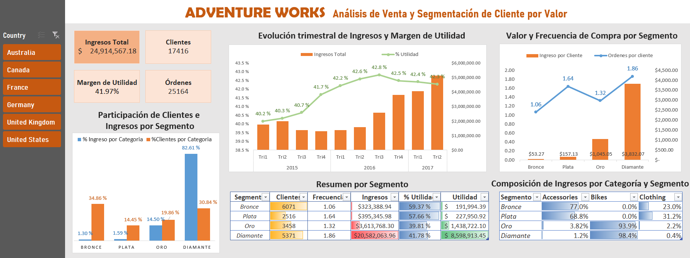

# Análisis de Ventas, Rentabilidad y Segmentación de Clientes | EXCEL

   
______
## 1. 📌 Resumen 
Este proyecto analiza las ventas de Adventure Works con el propósito de identificar cómo se distribuyen los clientes y los ingresos, evaluar el valor y la frecuencia de compra de cada segmento y detectar oportunidades para mejorar la rentabilidad y la relación con los clientes.

Los clientes fueron clasificados en cuatro segmentos según su nivel de compra acumulada:

* Bronce
* Plata
* Oro
* Diamante

El análisis fue desarrollado en Excel, utilizando Power Query para la preparación de los datos, Power Pivot para el modelado y la creación de medidas, y tablas y gráficos dinámicos para construir el dashboard.

El periodo analizado comprende desde 2015 hasta el segundo trimestre de 2017. Los importes se presentan en dólares estadounidenses como convención para el análisis.

_____
## 2. 📊 Dashboard 

*Nota.El presente dashboard muestra la evolución trimestral de los ingresos y el margen de utilidad, así como el valor, la frecuencia de compra y la rentabilidad de los segmentos Bronce, Plata, Oro y Diamante.*

## 3. Fuente de Datos:
Los datos originales los pueden encontrar [Aquí](https://www.kaggle.com/datasets/sprasad018/adventureworks-dataset?utm_source=chatgpt.com&select=AdventureWorks_Products.csv)

El conjunto de datos contiene cinco tablas dimensionales con archivos CSV relacionados con clientes, productos, categorías y territorios. Además de una tabla de hechos con la información de las ventas.

____
## 4. 🎯 Objetivos:
* **Analizar el desempeño de ventas en el tiempo:** 
Cómo evolucionaron los ingresos y la rentabilidad durante el periodo analizado.
* **Conocer a sus principales clientes y su comportamiento:**
Qué segmentos presentan mayor utilidad y margen de utilidad. Con qué frecuencia compran los clientes de cada segmento.Cuánto genera, en promedio, cada cliente.
* **Identificar los productos más y menos vendidos:** 
Qué categoría de producto predomina en cada segmento.
* **Analizar el desempeño por territorio:**
Cómo varían estos resultado según el país seleccionado.

___
## 5. 🛠️ Metodología 
El proyecto se desarrolló en las siguientes etapas:

1. Importación de los archivos CSV mediante Power Query.
2. Preparación y validación de los datos.
3. Construcción del modelo de datos y sus relaciones.
4. Segmentación de los clientes según su valor de compra.
5. Creación de medidas en Power Pivot.
6. Construcción de tablas dinámicas y del dashboard.

[Ver el proceso técnico completo](https://github.com/gabcadi30/analisis-ventas-segmentacion-clientes-excel/blob/main/proceso_tecnico.md)

___

## 6. 💡Hallazgos Principales 
* **Los ingresos están concentrados en los clientes de mayor valor** El segmento Diamante representa el 30.84% de los clientes, pero genera el 82.61% de los ingresos. También presenta el mayor ingreso promedio, con *$3,32.07 por cliente*, y la mayor frecuencia de compra, con 1.86 órdenes por cliente.
 En conjunto, Oro y Diamante representan el **50.70% de los clientes** y producen el **97.11% de los ingresos totales**.

* **Una mayor cantidad de clientes o un mayor margen de utilidad no garantizan una mayor contribución económica** Bronce concentra el 34.86% de los clientes, pero aporta solamente el 1.30% de los ingresos, con un promedio de $53.27 por cliente.
      Aunque Bronce y Plata presentan los mayores márgenes de utilidad, Diamante genera la mayor utilidad total debido a su elevado volumen de ingresos. Esto demuestra la importancia de evaluar conjuntamente el       margen, el volumen y el valor por cliente.

* **La categoría de producto diferencia a los segmentos** Las compras de Bronce y Plata se concentran principalmente en accesorios y ropa. En cambio, las bicicletas representan el 93.9% de los ingresos de Oro y el 98.4% de los ingresos de Diamante.
Esta composición explica gran parte de la diferencia en el ingreso promedio generado por cada segmento.

* **Los mercados presentan comportamientos diferentes** Estados Unidos es el principal mercado, con aproximadamente $7.94 millones, pero Australia alcanza el 93.4% de ese ingreso con menos de la mitad de clientes. Esto se relaciona con la mayor proporción de clientes Diamante en Australia: 44.7%, frente al 24.6% de Estados Unidos.
Por otro lado, Canadá registra el menor ingreso total, pero presenta el mayor margen de utilidad y la mayor frecuencia de compra entre los países analizados.

* **El primer semestre de 2017 casi alcanzó los resultados de todo 2016** Durante los primeros seis meses de 2017 se generaron aproximadamente $9.19 millones, equivalentes al 98.5% de los ingresos obtenidos durante todo 2016.
Este resultado estuvo impulsado por una mayor cantidad de clientes y órdenes. Sin embargo, el ticket promedio disminuyó de $871.83 en 2016 a $775.86 en 2017, mientras que el margen se mantuvo alrededor del 42%.

---

## 7. Conclusiones

* **El valor de los clientes no depende únicamente de su cantidad.** El ingreso promedio, la frecuencia de compra y el tipo de producto adquirido son determinantes para comprender la contribución real de cada segmento.

* **Adventure Works presenta una concentración importante de ingresos.** El negocio depende principalmente del segmento Diamante y de los mercados de Estados Unidos y Australia, lo que representa una fortaleza comercial y, al mismo tiempo, un riesgo de dependencia.

* **Los segmentos y mercados requieren estrategias diferentes.** Algunos grupos destacan por su volumen de ingresos, mientras que otros presentan mejores márgenes o una mayor frecuencia de compra. Por ello, no todos deben gestionarse con los mismos objetivos comerciales.

* **El desempeño de 2017 fue impulsado por el crecimiento del volumen.** El aumento de clientes y órdenes permitió alcanzar casi todo el ingreso de 2016 en seis meses, pero la reducción del ticket promedio muestra que el crecimiento no provino de compras individuales de mayor valor.

---

## 8. Recomendaciones

* Fidelizar a los clientes Diamante. Implementar beneficios exclusivos, atención preferencial y seguimiento posventa para proteger al segmento que genera la mayor parte de los ingresos y de la utilidad.

* Incrementar el valor de Bronce, Plata y Oro. Utilizar promociones por recompra, paquetes de productos y venta cruzada para aumentar su frecuencia y gasto promedio. En los clientes que compran bicicletas, se pueden recomendar accesorios y ropa como productos complementarios para facilitar su migración hacia segmentos de mayor valor.

* Evaluar la calidad de los nuevos clientes y de los canales de captación.  El crecimiento de 2017 estuvo acompañado por un menor ticket promedio. Por ello, se recomienda priorizar los canales que atraigan clientes con mayor ingreso, frecuencia y potencial para convertirse en Oro o Diamante, en lugar de evaluar la captación únicamente por cantidad.

* Diseñar estrategias según el comportamiento de cada mercado. En Australia se debe priorizar la retención de clientes de alto valor; en Estados Unidos, aumentar la frecuencia de compra; y en Canadá, ampliar la base de clientes conservando su rentabilidad.

* Complementar la segmentación con el comportamiento reciente. Incorporar un análisis RFM permitiría identificar qué clientes compraron recientemente, cuáles mantienen una frecuencia elevada y cuáles tienen mayor valor monetario, incluyendo posibles clientes Diamante que estén reduciendo su actividad.

____________

 👤 Autor
 
**Gabriela Cadillo** - *Junior Data Analyst*

