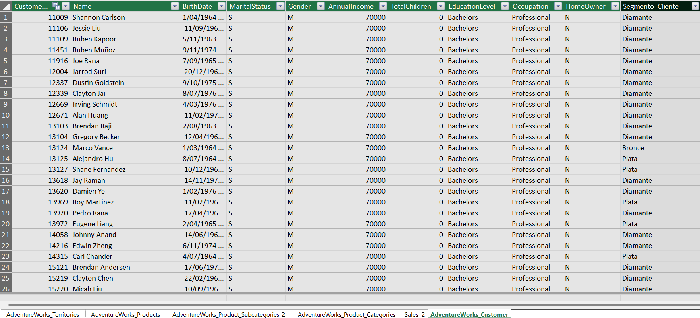
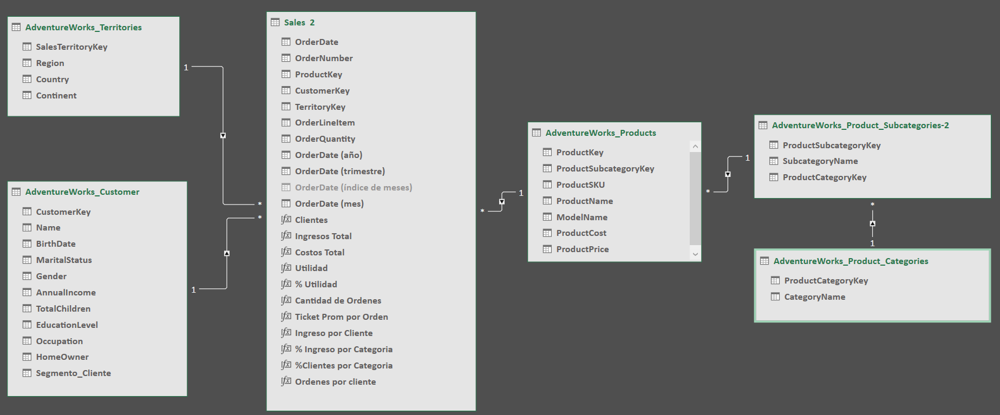
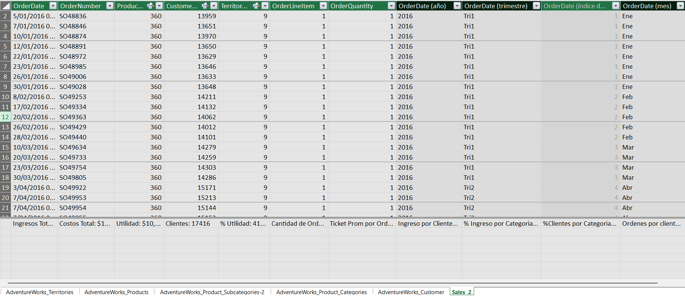
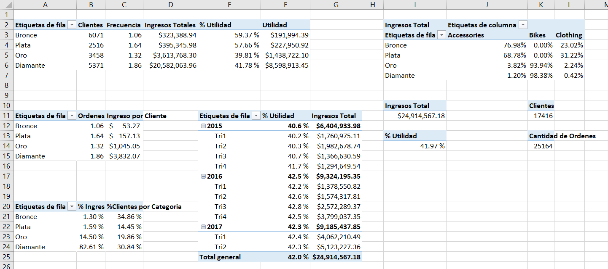
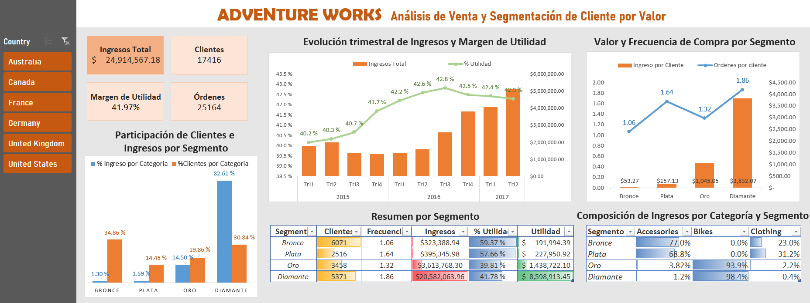

# Proceso Técnico

Informe: [Análisis de Venta y Segmentación de Clientes](https://github.com/gabcadi30/analisis-ventas-segmentacion-clientes-excel)

El proyecto fue desarrollado en Excel utilizando Power Query, Power Pivot, medidas DAX, tablas dinámicas y gráficos dinámicos.

## 1. Importación y preparación de datos

Los archivos CSV fueron importados mediante Power Query y cargados como conexiones al modelo de datos.

Se eligió la opción **“Solo crear conexión”** para evitar cargar las tablas completas en las hojas de Excel, reducir el peso visual del documento y mejorar su agilidad.

A partir de la columna `OrderDate` se crearon las columnas calculadas de año y trimestre:

```DAX
Año = FORMAT([OrderDate]; "YYYY")
```

```DAX
Trimestre = "Tri" & ROUNDUP(MONTH([OrderDate]) / 3; 0)
```

Estas columnas permitieron analizar la evolución de los ingresos y del margen de utilidad por periodos trimestrales.

## 2. Segmentación de clientes

En la tabla `AdventureWorks_Customers` se creó la columna calculada `Segmentacion_cliente`, utilizando el ingreso acumulado de cada cliente:

```DAX
Segmentacion_cliente =
 SWITCH( TRUE();
    [Ingresos Total] <= 100; "Bronce";
    [Ingresos Total] <= 500; "Plata";
    [Ingresos Total] <= 2000; "Oro";
    "Diamante" )
```


Los clientes fueron clasificados de la siguiente manera:

| Segmento |          Ingreso acumulado |
| -------- | -------------------------: |
| Bronce   |                 Hasta $100 |
| Plata    |   Más de $100 y hasta $500 |
| Oro      | Más de $500 y hasta $2,000 |
| Diamante |              Más de $2,000 |

Esta clasificación permitió comparar el valor, la frecuencia de compra y la rentabilidad de los diferentes grupos de clientes.


## 3. Modelo de datos

Las tablas fueron agregadas al modelo de datos de Excel y relacionadas en Power Pivot.

Se construyó una estructura de tipo estrella con `Sales 2` como tabla de hechos y cinco tablas dimensionales:

* `Customers`
* `Products`
* `Category`
* `Subcategory`
* `Territories`

El modelo permitió analizar las ventas por cliente, producto, categoría, territorio y periodo sin cargar todas las tablas en hojas independientes.



## 4. Medidas DAX

Las medidas fueron creadas y organizadas en la tabla `Sales 2`.

Entre las principales medidas utilizadas se encuentran:

* Ingresos totales.
* Costo total.
* Utilidad.
* Margen de utilidad.
* Clientes únicos.
* Cantidad de órdenes.
* Ticket promedio por orden.
* Ingreso por cliente.
* Participación de ingresos por segmento.
* Participación de clientes por segmento.
* Órdenes por cliente o frecuencia de compra.

Estas medidas se recalculan automáticamente según el segmento o país seleccionado.



## 5. Tablas dinámicas 

Se crearon tablas dinámicas para analizar:

* Indicadores generales de ventas.
* Evolución trimestral de ingresos y margen.
* Participación de clientes e ingresos por segmento.
* Ingreso y frecuencia de compra por cliente.
* Utilidad y margen por segmento.
* Composición de ingresos por categoría de producto.



A partir de estas tablas se construyeron los gráficos y el dashboard final.

## 6. Dashboard 
El presente dashboard combina gráficos dinámicos, tablas, formato condicional y un segmentador por país que permite filtrar los resultados de Australia, Canadá, Francia, Alemania, Reino Unido y Estados Unidos.




* La información de 2017 solo está disponible hasta junio. Por esta razón, no se comparó 2017 como un año completo frente a 2015 y 2016. La evolución se presentó por trimestre, mostrando cuatro trimestres para 2015 y 2016, y únicamente los dos primeros trimestres de 2017. Esto permite utilizar la información disponible sin generar una comparación anual engañosa.

---

[← Volver al README principal](README.md)
